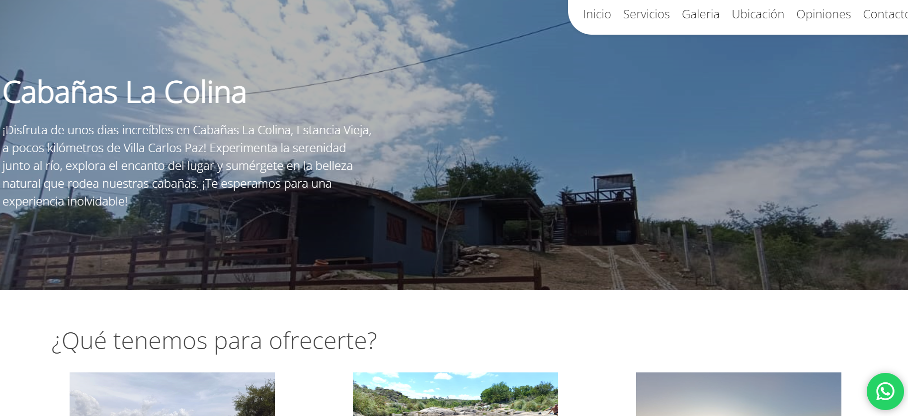
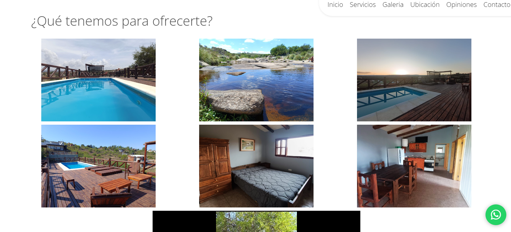
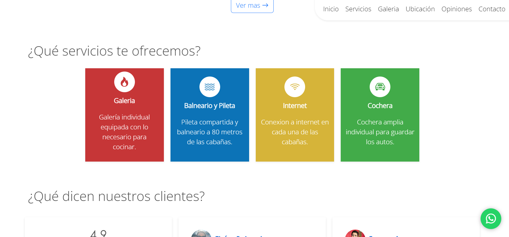
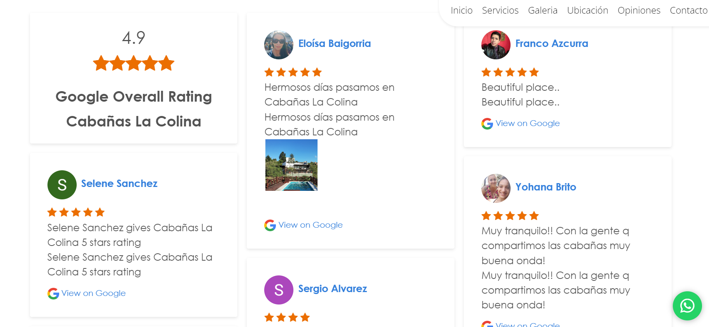
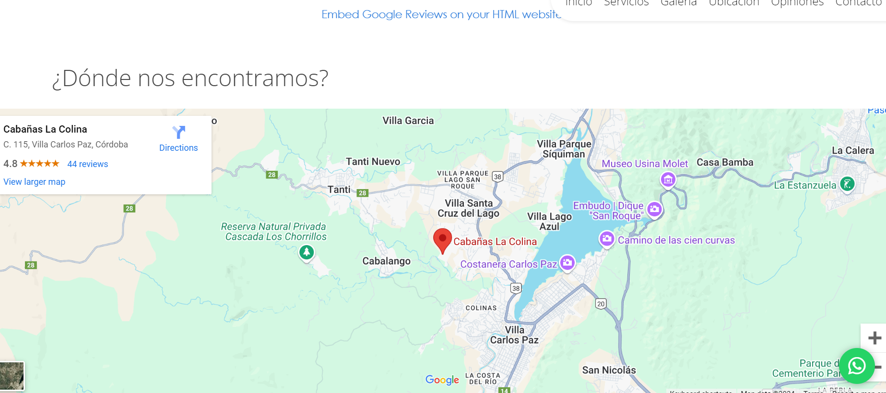

# 🏡 Cabin Complex Website for Villa Carlos Paz, Argentina

**🌍 Location:** Villa Carlos Paz, Argentina  
**✨ Project Overview:** This repository showcases a beautifully designed landing page for a charming cabin complex nestled in the picturesque landscapes of Villa Carlos Paz. The website serves as an informative platform for potential visitors, providing all the essential details about the complex.

## 📖 Description
Welcome to our **Cabin Complex** landing page! This site offers a cozy and inviting digital space that highlights the unique features and amenities of our cabins. Set against the backdrop of breathtaking mountains and serene lakes, this landing page acts as a gateway for travelers looking to explore the tranquility and beauty of this stunning region.

### 🌟 Key Features
- **Responsive Design:** Ensures a seamless browsing experience on all devices, from smartphones to tablets and desktops.
- **Stunning Visuals:** Showcases high-quality images that capture the beauty of the cabins and their surroundings.
- **Contact Information:** Provides an easy way for potential guests to reach out to the owner for inquiries or bookings.
- **Location Map:** Includes an interactive map to help visitors find the cabin complex easily.

## 🛠️ Technologies Used
- **HTML5:** For structuring the website content.
- **CSS3:** To create a visually appealing and engaging layout.
- **JavaScript:** To enhance interactivity and user experience.

## 📸 Preview
Check out the visuals of our cabin complex and get inspired for your next vacation!  

